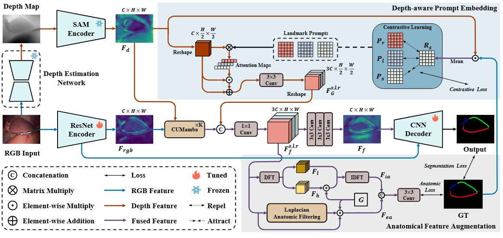
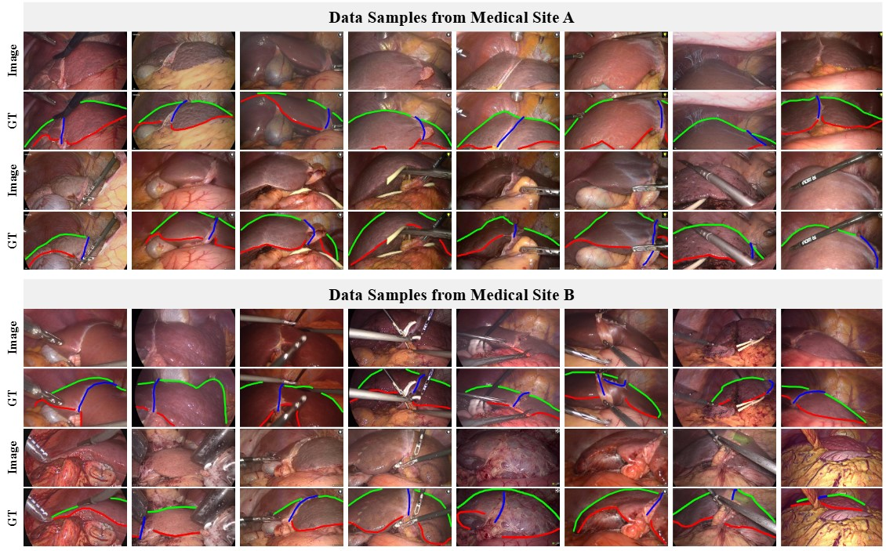

<div align=center>
<h1>D2GPLand+: Depth-Induced Prompt Learning for Laparoscopic Liver Landmark Detection</h1>

[**Ruize Cui**](https://scholar.google.com/citations?hl=en&user=rAcxfuUAAAAJ), [**Weixin Si**](https://scholar.google.com/citations?user=E4efwTgAAAAJ&hl=zh-CN&oi=ao), **Zhixi Li**, **Kai Wang**, [**Jialun Pei**](https://scholar.google.com/citations?user=1lPivLsAAAAJ&hl=en), [**Pheng-Ann Heng**](https://scholar.google.com/citations?user=OFdytjoAAAAJ&hl=en), and [**Jing Qin**](https://harry-qinjing.github.io/)

**Contact:** ruize.cui@connect.polyu.hk, peijialun@gmail.com

<a href="https://arxiv.org/abs/2507.00519"></a>

Official Implementation of paper "*Depth-Induced Prompt Learning for Laparoscopic Liver Landmark Detection*"


</div>

## Environment preparation
The code is tested on python 3.9.23, pytorch 1.10.1, and CUDA 11.3.1, change the versions below to your desired ones.
1. Clone repository:
```shell
git clone https://github.com/cuiruize/D2GPLand-Plus.git

cd D2GPLand-Plus
```
   
2. Set up anaconda environment:
```shell
# Create DVPT anaconda environment from YAML.file
conda env create -f D2GPLandPlus.yaml
# Activate environment
conda activate D2GPLandPlus
```

3. Set up related module

Install pan-Mamba [[Pan-Mamba](https://github.com/alexhe101/Pan-Mamba/)]

## Dataset preparation

### Download evaluation datasets
- L3D dataset: https://github.com/PJLallen/D2GPLand
- P2ILF dataset: https://p2ilf.grand-challenge.org/

### L3D-2K Dataset
- L3D-2K dataset: [Google Drive](https://drive.google.com/drive/folders/1OFPQ97dAza-ZMQlukSBqL2x96ULpkJvR?usp=sharing)


### Register datasets
Change the path of the datasets as:
```shell
DATASET_ROOT = 'D2GPLand-Plus/L3D/'
or
DATASET_ROOT = 'D2GPLand-Plus/P2ILF/'
or
DATASET_ROOT = 'D2GPLand-Plus/L3D-2K/'
```

## Pre-trained weightts

D2GPLand+ weights: [Google Drive](https://drive.google.com/drive/folders/1w98V81BlyI0kdqElUNkUmUh6zINU8qjd?usp=sharing)

Depth Anything V2 with vitb pre-trained weights: [Depth-Anything-V2](https://github.com/DepthAnything/Depth-Anything-V2)

SAM with vitb pre-trained weights: [Segment Anything](https://github.com/facebookresearch/segment-anything)

Put the weights of Depth Anything V2 and SAM under the path folder:
```shell
Depth_root = 'D2GPLand-Plus/path/depth_anything_v2_vitb.pth'
SAM_root = 'D2GPLand-Plus/path/sam_vit_b_01ec64.pth'
```

## Train

```shell
python train.py --data_path {PATH_TO_DATASET} --save_dir {PATH_TO_SAVE_RESULTS} --batch_size 2 --epoch 60
```

- {PATH_TO_DATASET}: path to your own dataset dir
- {PATH_TO_SAVE_RESULTS}: path to save training results

## Eval

```shell
python test.py --model_path {PATH_TO_THE_MODEL_WEIGHTS} --data_path {PATH_TO_DATASET} --save_path {PATH_TO_SAVE_RESULTS}
```

- {PATH_TO_THE_MODEL_WEIGHTS}: path to the pre-trained model weights

## Acknowledgement
This work is based on:

- [Depth Anything V2](https://github.com/DepthAnything/Depth-Anything-V2)
- [Segment Anything](https://github.com/facebookresearch/segment-anything)
- [Pan-Mamba](https://github.com/alexhe101/Pan-Mamba/)

Thanks them for their great work!

## Citation

If this helps you, please cite this work:

```bibtex
@article{cui2026depth,
  title={Topology-Constrained Learning for Efficient Laparoscopic Liver Landmark Detection},
  author={Cui, Ruize and Si, Weixin and Li, Zhixi and Wang, Kai and Pei, Jialun and Heng, Pheng-Ann and Qin, Jing},
  year={2026},
}
```
